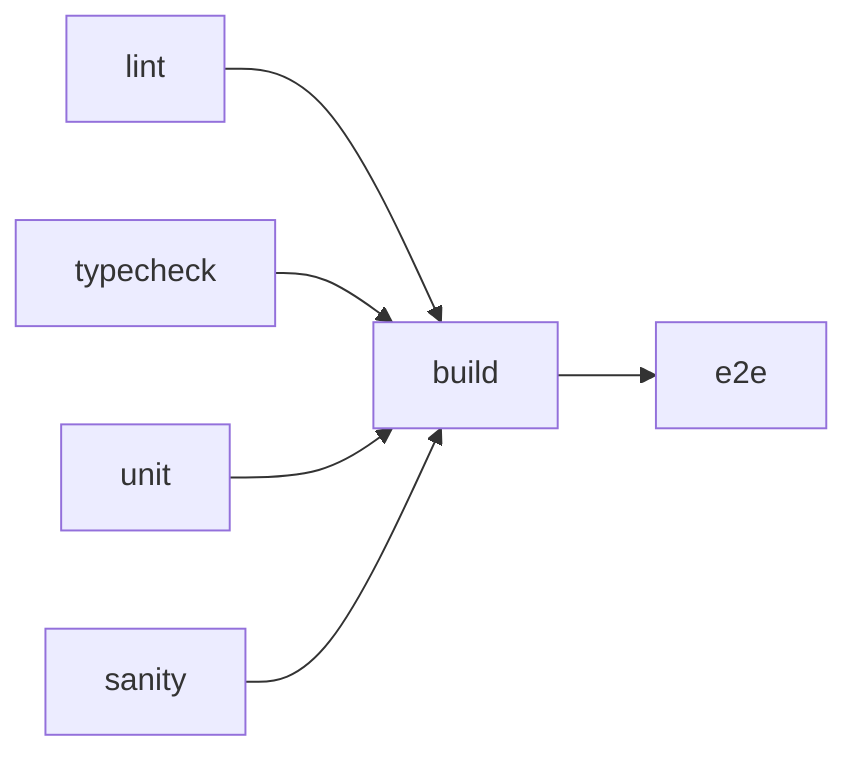

# DevOps Guide — PriceGenie AI

This document describes CI/CD, testing, Docker, security scanning, and deployment for PriceGenie AI.

## Toolchain

| Tool | Purpose |
|------|---------|
| **GitHub Actions** | CI, security, Docker build, CD |
| **Vitest** | Unit tests + code coverage |
| **Playwright** | End-to-end browser tests |
| **ESLint** | Static analysis |
| **TypeScript** | Type checking (`tsc --noEmit`) |
| **tsx** | Catalog sanity checks |
| **Trivy** | Container vulnerability scanning |
| **CodeQL** | SAST for JavaScript/TypeScript |
| **Dependabot** | Weekly dependency updates |

## Local commands

```bash
# Install (Node 22 — see .nvmrc)
npm ci

# Development
npm run dev

# Full quality gate (no E2E)
npm run check

# Full gate including E2E
npm run check:all

# CI-equivalent (with coverage)
npm run ci

# Unit tests
npm run test
npm run test:coverage
npm run test:watch

# E2E
npm run test:e2e

# Security
npm run audit

# Docker
npm run docker:build
npm run docker:up
npm run docker:down
```

## GitHub Actions workflows

| Workflow | File | Triggers | What it does |
|----------|------|----------|--------------|
| **CI** | `.github/workflows/ci.yml` | push/PR → `main` | lint, typecheck, unit+coverage, sanity, build, E2E |
| **Security** | `.github/workflows/security.yml` | push/PR + weekly | `npm audit`, CodeQL |
| **Docker** | `.github/workflows/docker.yml` | push/PR → `main` | Build image, Trivy scan, push to GHCR on `main` |
| **CD** | `.github/workflows/cd.yml` | push → `main` | Runs `npm run ci`, deploys to Vercel if secrets set |

### CI pipeline



### Required secrets (CD)

| Secret | Description |
|--------|-------------|
| `VERCEL_TOKEN` | Vercel personal/team token |
| `VERCEL_ORG_ID` | Vercel team/org ID |
| `VERCEL_PROJECT_ID` | Vercel project ID |

CD skips deploy gracefully when secrets are not configured.

## Docker

Multi-stage build using Next.js `standalone` output (enabled via `DOCKER_BUILD=1` in the Dockerfile only):

```bash
docker build -t pricegenie-ai:local .
docker run -p 3000:3000 pricegenie-ai:local
```

Or with Compose:

```bash
docker compose up --build
```

Production image runs as non-root user `nextjs` on port **3000**.

Images pushed to **GitHub Container Registry** on `main`:

`ghcr.io/shohrabniaz/pricegenie-ai:latest`

## Code coverage

Coverage is collected for `src/lib/**` with Vitest + v8. Thresholds:

- Lines / statements / functions: **65%**
- Branches: **55%**

Reports are uploaded as CI artifacts (`coverage-report`).

## Security

- **npm audit** runs on every push/PR (high severity+); results uploaded as artifacts.
- **CodeQL** runs static analysis weekly and on push/PR.
- **Trivy** scans Docker images for CRITICAL/HIGH CVEs.
- **Dependabot** opens weekly PRs for npm and GitHub Actions.

Report vulnerabilities privately — see [SECURITY.md](../SECURITY.md).

## Node version

CI and Docker use **Node 22** (`.nvmrc`). Match locally:

```bash
nvm use
```
